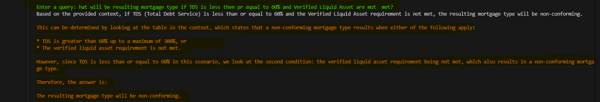

# PDF Document Analysis and Q&A System

## Problem Statement

In today's digital age, organizations and individuals often deal with numerous PDF documents containing valuable information. However, extracting specific information from multiple PDFs can be time-consuming and inefficient. Traditional methods of searching through PDFs are limited to basic keyword matching and don't understand the context or semantic meaning of the content. This creates a need for an intelligent system that can:

- Process multiple PDF documents efficiently
- Understand the context and content of the documents
- Provide accurate answers to natural language queries
- Scale with growing document collections

## Solution

This project implements an intelligent PDF analysis and question-answering system that leverages Large Language Models (LLMs) and vector embeddings to provide contextual answers from PDF documents. The solution:

- Automatically processes and ingests PDF documents
- Creates semantic embeddings for efficient information retrieval
- Uses LLMs to generate human-like responses based on document content
- Provides a simple command-line interface for querying documents
- Supports multiple LLM models through Ollama integration
- Scales efficiently with document collection growth

## Tech Stack

- **Python**: Primary programming language
- **Ollama**: Local LLM deployment and management
- **LangChain**: Framework for developing LLM applications
- **Vector Database**: For storing and retrieving document embeddings
- **PDF Processing Libraries**: For extracting text from PDF documents
- **Supported Models**:
  - llama2:13b
  - llama3.1:8b
  - Other Ollama-compatible models

# Example

### Source of Information from PDF document.


_Screenshot showing the PDF with answer_

### Question and Answer Interface


_Screenshot of the command-line interface showing a sample query and response_

## Setup and Installation

#### Step 2: Step a Virtual Environment

```
conda create -n venv
```

#### Step 3:Activate virtual enviroment

```
conda activate venv/
```

#### Step 4: Install the Requirements

```
pip install -r requirements.txt
```

#### Step 3: Pull the models (if you already have models loaded in Ollama, then please skip next command)

#### Make sure to have Ollama running on your system from https://ollama.ai

```
ollama pull llama3.1:8b
```

#### Step 4: put your files in the my_pdfs folder after making a directory

```
mkdir my_pdfs
```

#### Step 5: Ingest the files (use python3 if on mac)

```
python readpdf.py
```

Output should look like this:


_Screenshot of the command-line interface showing PDF being broken into chunks and storing them in vector DBs_

#### Step 6: Run this command (use python3 if on mac)

```
python Talkingpdfs.py
```

##### Play with your docs

Enter a query: How many locations does WeWork have?

### Try with a different model:

```
ollama pull llama3.1:8b
MODEL=llama3.1:8b python Talkingpdfs.py
```


_Screenshot of the command-line interface showing how to run the llama3.1 in local system_

## Add more files

Put any and all your files into the `my_pdfs` directory

The supported extensions are:

- `.pdf`: Portable Document Format (PDF),

## Future Enhancements

### 1. Extended Document Support

- Support for additional document formats (.docx, .txt, .xlsx, .pptx)
- Handle scanned PDFs through OCR integration
- Support for documents with tables, charts, and images
- Multi-language document support and cross-language querying

### 2. Advanced Query Capabilities

- Multiple document comparison and cross-referencing
- Support for complex queries requiring mathematical calculations
- Document summarization features
- Topic modeling and document clustering
- Query templates for common information extraction patterns

### 3. Enhanced User Experience

- Web-based user interface with document visualization
- Real-time document processing status
- Query history and favorite queries
- Document annotation and highlighting
- Export functionality for answers and citations
